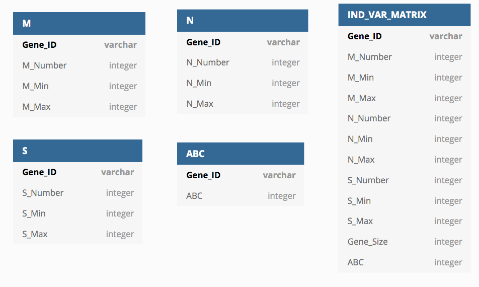

### Hi ! Welcome to the ABC Project !
The aim of this project is to develop a method to detect genes part of ABC systems across all the phylogenetic tree. The data used for this project are not publicly available and belongs to the CBI of Toulouse - France [https://cbi-toulouse.fr/eng/](https://cbi-toulouse.fr/eng/). 

## Requirements
Versions used for the project : 

- `mysql` 8.0.24  
- `conda` 4.9.1  
- `python` 3.7  
- Database creation script and data provided by the CBI are required for this project

## Installation
**All the scripts should be executed from the project root**

- Create database from CBI [https://cbi-toulouse.fr/eng/equipe-fichant](https://cbi-toulouse.fr/eng/equipe-fichant)

- Download or git clone the latest version of this project from the next link [https://gitlab.com/Trocentraisin/datamining.abc.git](https://gitlab.com/Trocentraisin/datamining.abc.git)

- `installation/installation.sh` creates : 
  - conda environment with all the required libraries
  - retrieve username and password to connect to the desired database
  
*Note: username and password are stored localy in the following file `data.preparation/configurations/config.py`.*

**THIS FILE IS NOT ENCRYPTED AND USERNAME AND PASSWORD ARE STORED IN CLEAR !**

## Steps of the project

- Creation of a matrix `data.preparation/matrix_script.py` which includes : 
  - a training set
  - a test set
  - a set to classify 
  
This matrix is structured with genes as rows and variables as columns. This matrix is further described in the Matrix Creation part.

- Creation and use of the classifier 
  - training 
  - performances evaluation
  - classification 

## Matrix Creation 
**DON'T FORGET TO ACTIVATE YOUR CONDA ENVIRONMENT**

`data.preparation/matrix_script.py` creates four intermediates views to construct the final matrix. Three compute the number of MSD, NBS and SBP domains as well as the minimal and maximum e-value (from rps bast alignment) for each gene in the database. The fourth one assigns the class of each gene:

  - `true` for genes confirmed to belong to ABC systems
  - `false` for genes confirmed to not being part of an ABC system
  - `null` for genes where it is unknown of there are part of an ABC system or not
  
Eventually, the final matrix is built from multiple joining on those views.

 
*Arguments :*

- `-b --database         [required] name of database you want to connect to`
- `-d, --drop            [option]   drop all views`
- `-c, --create_views    [option]   create intermediary views`

The matrix is written in `data.preparation/matrix_ind_var.tsv` to avoid further connection problems to the database and reduce execution time.

## Analysis
`analysis/analysis_script.py` computes the training, performances evaluation and classification of the unknown genes. 
This classifier is based on the Random Forest method implemented by scikit learn library. 

Various parameters have been tested to improve classifier performances: 

- Gini and Enthropy criterion 
- Training set composition : 
  - balanced : 50% ABC, 50% non-ABC
  - proportion observed in nature
- depth of estimators (trees)
- number of estimators (trees)

Arguments :

  - `-h, --help  show this help message and exit`
  
  - `-m {full,balanced}, --mode {full,balanced} Train on full set or balanced set (default : full set)`
  
  - `-d, --max_depth max depth of the each tree (default : None)`
  
  - `-n, --n_estimators number of estimators (default:100)`
  
  - `-c {gini,entropy} --criterion {gini,entropy}` 
function to measure the quality of a split. Supported criteria are “gini” for the Gini impurity and “entropy” for the information gain (default: entropy)`
  
  - `-b, --base base of the filenames in which the results are stored, without any extensions (default: results)`
  
  - `-t, --save_trees include if the trees should be plotted`
  
  - `-s , --seed   32-bit integer to seed the run (default: 1148823)`

You can reproduce the results between executions with `-s`.

You can save results and plots with `-t` and `-b` arguments. Both are stored in `analysis/`.

# Contact

If you encounter any difficulty contact us at victoria.fathi@univ-tlse3.com or sophia.toffoli@univ-tlse3.fr .

