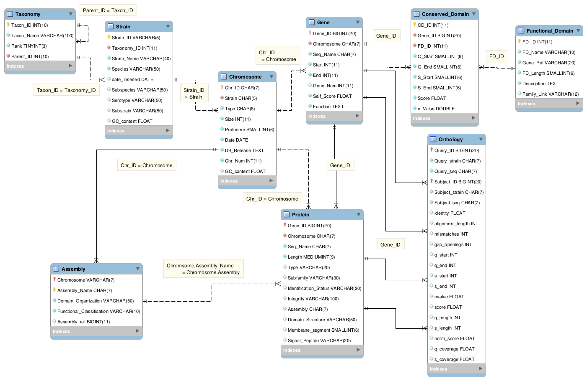

# Contexte

Dans le cadre de l'UE Fouille de données, un jeu de données comprenant des annotations sur des génomes Eucaryotes, Procaryotes et d'Archées nous a été fourni. Ce jeu de données appartient au de CBI de Toulouse et n'est donc pas disponible sur ce gitlab. 

L'objectif de ce projet est de mettre au point une méthode de classification des gènes impliqués dans les systèmes de transport ABC. 

# Analyse

**Précisions sur les objectifs à atteindre et comment y arriver.**

- évaluer la qualité de la méthode: forêt aléatoire   
- analyser l’arbre pour essayer d’en déduire les variables discriminantes   
- utiliser l’arbre pour prédire les gènes annotés dont l’Identification_status = ‘pending’ ou null.   

**Analyse préliminaire des données pour les appréhender ainsi que les méthodes disponibles pour atteindre les objectifs.**   

Pour cela, nous voudrions travailler sur une matrice individus-variables avec comme individus: 
-  les gènes non présent dans la table Protein; correspondant aux gènes n'appartenant pas à un système ABC
-  les gènes présents dans la table Protein ayant  Identification_status = 'Confirmed' excluant les 'Pending' et 'Rejected' afin de n'avoir que des gènes dont est sûr de la prédiction; correspondants aux gènes appartenant à un système ABC. 

Pour les variables, nous avions pensé: 
- le nombre de domaines, la e_value minimale et la e_value maximale pour le domaine MSD
- le nombre de domaines, la e_value minimale et la e_value maximale pour le domaine NBD
- le nombre de domaines, la e_value minimale et la e_value maximale pour le domaine SBP

Pour chaque gène, nous récupérons ses domaines fonctionnels. 
Sur ces domaines conservés (jointure avec Conserved_Domain), nous récupérons le domaine fonctionnel auquel il correspond (jointure avec Functional_Domain), à partir duquel on extrait la famille de domaine correspondant à la première lettre du Family_Link.

Pour chaque gène, Pour chaque famille de domaine fonctionnel (MSD, NBS, SBP)  les domaines sont résumés par le nombre de domaines fonctionnels de cette famille sur ce gène, la e-value minimale et la e-value maximale. Si cette famille est absente sur ce gène, 
 la e_value est fixée à null (ou +inf; à préciser) et le nombre de domaine à 0 pour la famille de domaine correspondante.

Si vous souhaitez voir le code correspondant, il est disponible sur notre gitlab avec le chemin suivant:  data.preparation/matrix_script.py (vous avez normalement reçu une invitation sur votre compte gitlab) 

Notons qu’ici les e-values sont comparables puisque rps-blast utilise les trois bases de données concaténées pour sa recherche donc l’espace de recherche est de même taille pour l’ensemble des requêtes. (Pourriez vous nous confirmer cette information)

-le gene_size correspondant à la taille du gène: | Gene.End - Gene.Start  + 1 |
- le self_score qui pourrait éventuellement permettre de distinguer les mauvaises prédictions des bonnes.
- ABC : un booléen déterminant si oui ou non un gène code pour une protéine d’un système ABC 

- mysql  
- python  
- mysql connector  
- scikit learn   

# Conception

Fort de l'analyse précedente, présenter l'approche choisie et pourquoi. Quelle méthodologie allez-vous mettre en oeuvre pour les différentes étapes du projet avec quelles méthodes (par exemple : obtention de la matrice pour l'analyse, puis quelle méthode de classification et comment se fera l'évaluation). 

# Réalisation

Mise en oeuvre de ce qui a été conçu. Il s'agit la de préciser les paramètres et tous les détails concernant la réalisation concrète de l'analyse. Puis de décrire les résultats obtenus.

# Discussion

Analyse et discussion sur les résultats obtenus. 

Conclusions sur la qualité de la ou des méhtodes mises en oeuvre.

# Bilan et perspectives

Qu'est-ce qui fonctionne ou pas. Piste d'amélioration. Recul sur l'ensemble du projet. Si c'était à refaire...

# Gestion du projet

Comment s’est organisé le groupe. Comment se sont déroulées les discussions, les prises de décisions. Comment se sont répartities les tâches. Quels ont été les rôles et les contributions de chacun·e. Diagramme de Gantt avec le calendrier et les tâches.

