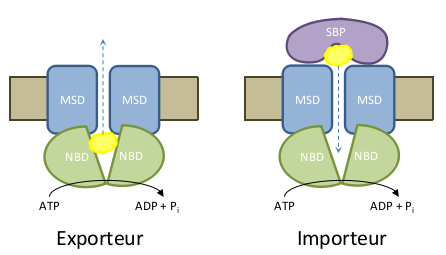

Pour la remise du projet, un fichier Markdown consitutant le rapport devrait remplacer ce README.

Bien qu'au format markdown, ce sera un vrai rapport de projet.

# Contexte

Une introduction sur le contexte et les objectifs du projet.

# Analyse

Précisions sur les objectifs à atteindre et comment y arriver. 

Analyse préliminaire des données pour les appréhender ainsi que les méthodes disponibles pour atteindre les objectifs.

# Conception

Fort de l'analyse précedente, présenter l'approche choisie et pourquoi. Quelle méthodologie allez-vous mettre en oeuvre pour les différentes étapes du projet avec quelles méthodes (par exemple : obtention de la matrice pour l'analyse, puis quelle méthode de classification et comment se fera l'évaluation). 

# Réalisation

Mise en oeuvre de ce qui a été conçu. Il s'agit la de préciser les paramètres et tous les détails concernant la réalisation concrète de l'analyse. Puis de décrire les résultats obtenus.

# Discussion

Analyse et discussion sur les résultats obtenus. 

Conclusions sur la qualité de la ou des méhtodes mises en oeuvre.

# Bilan et perspectives

Qu'est-ce qui fonctionne ou pas. Piste d'amélioration. Recul sur l'ensemble du projet. Si c'était à refaire...

# Gestion du projet

Comment s’est organisé le groupe. Comment se sont déroulées les discussions, les prises de décisions. Comment se sont répartities les tâches. Quels ont été les rôles et les contributions de chacun·e. Diagramme de Gantt avec le calendrier et les tâches.

