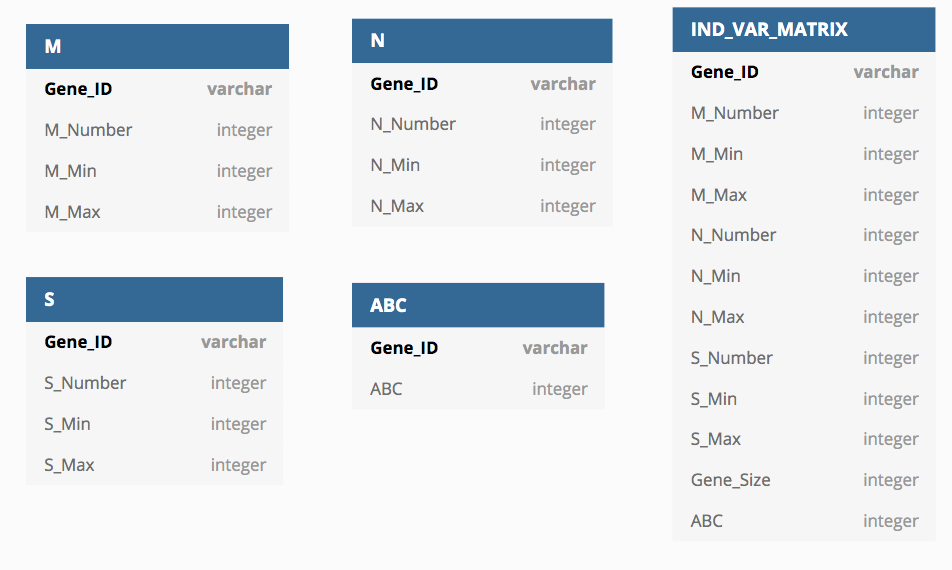

<div style="text-align: justify">

# Contexte
$\quad$Dans le cadre de l'UE Fouille de Données, un jeu de données comportant des annotations sur des génomes Eucaryotes, Procaryotes et d'Archées a été fourni. Ce jeu de données appartient au CBI de Toulouse et n'est donc pas disponible sur ce gitlab. L'annotation de ces génomes porte une attention toute particulière aux systèmes ABC.


$\quad$Les systèmes ABC sont une grande famille multigénique présente dans les trois domaines du vivants. Ces systèmes sont majoritairement des transporteurs et possèdent une architecture conservée. Celle-ci implique la présence de 2 ou 3 domaines selon que le système soit importeur ou exporteur. Ceux-ci sont : 

- MSD (Membrane Spanning Domain) 
- NBD (Nucleotide Binding Domain)
- SBP (Solute Binding Protein) : uniquement chez les systèmes importeurs


$\quad$Ces domaines peuvent être portés par une ou plusieurs protéines qui, en association, forment le système de transport. Ainsi, un gène codant pour un partenaire d'un système ABC peut porter un ou plusieurs de ces domaines.

$\quad$L'objectif de ce projet est de mettre au point un classificateur permettant de déterminer si un gène code ou pas pour un partenaire d'un système ABC. 


# Analyse

*Un script d'intégration des données a été fourni par l'équipe du CBI pour la création de la base de données suivante.*


<br>

$\quad$Grâce à la table protéine, la classe ABC ou non-ABC est connue pour la plupart des gènes. Ainsi, un apprentissage supervisé est tout indiquée. Parmi les méthodes vues lors de l'UE dans laquelle s'inscrit ce projet, les suivantes sont celles disponibles : 

- Arbre de décision
- Forêt aléatoire
- Classification naïve bayésienne
- K plus proches voisins

Pour choisir la méthode la plus adaptée, une première analyse des données est nécéssaire. 

### Quelles variables choisir ? 

$\quad$Les individus étudiés sont les gènes; identifiés par la table *Gene*. Chacun d'eux est associé à une espece, une souche (table *Taxonomy* et *Strain*) et à un chromosome (table *Chromosome*).Étant donné la diversité des données existentes et la difficulté à les synthétiser, l'utilisation des données taxonomiques et chromosomiques semble peu pertinente. Pour les mêmes raisons, les données d'orthologie 1:1 entre les individus (table *Orthology*) sont rejetées.

$\quad$À cela s'ajoute pour les gènes associés à un système ABC, un ensemble d'informations sur les complexes formés et l'arrangement des domaines(table *Assembly*). Ces données partent donc de l'hypothèse que les gènes ayant ces données sont ABC. Ainsi, elles ne sont pas non-plus pertinentes.

$\quad$Il reste ainsi des données sur l'identification des gènes (*Gene*), leur domaines (*Conserved_Domain* et *Functional_Domain*) et leur appartenance ou non à un système ABC (*Protein*). L'objectif est de selectionner les variables quantitatives et comparables ou qualitatives. 

$\quad$Au sein de *Gene*,les attributs start et stop ne sont pas comparables car dépendant du chromosome. Cependant, il est possible d'en extraire la longueur de chaque gène. Les autres attributs de cette table ne sont pas exploitables.

$\quad$Concernant les informations sur les domaines protéiques, seule la présence (ou l'absence) d'un des domaines des système ABC est interesante. En effet, même si les protéines des systèmes ABC peuvent présenter d'autres domaines sont ceux les domaines M, S et D qui caractérise ces systèmes. L'accession à cette information se fait au travers de l'attribut Family_Link de la table *Fonctional_Domain*. Chaque domaine identifié possède une e-value issue la recherche avec rps-blast.

$\quad$Notons qu’ici les e-values sont comparables puisque la recherche avec rps-blast a été réalisé à partir de plusieurs bases de données concaténées pour sa recherche. L’espace de recherche est donc de même taille pour l’ensemble des requêtes.

Ainsi, pour chaque gène et chaque famille de domaine fonctionnel (MSD, NBS, SBP) il est possible de d'obtenir : 

- le nombre de domaines fonctionnels de cette famille sur ce gène
- la e-value minimale
- la e-value maximale. 


$\quad$Enfin, au sein de la table *Protein* il existe une subtilité puisque tous les gènes présents dans cette table ne sont pas des ABC, ni nécessairement validés. 

### Quels individus choisir ?

$\quad$Pour obtenir un classificateur performant, il est nécéssaire de l'entrainer sur des individus correctement étiquetés. 

Il apparait que les gènes absents de la table *Protein* n'ont pas été identifiés comme appartenant à un système ABC. Notons tout de même la possibilité de faux négatifs dans cette approche.

Au sein des gènes de la table Protein, l'attribut *type* identifie les gènes appartenant à un système ABC. Le niveau de confiance de cet etiquetage est retrouvé dans l'attribut *Identification_Status*. Celui-ci comporte trois états possibles : 'Pending', 'Confirmed' ou 'Rejected'. Les données de cette table étant expertisées, il est possible de considérer que les données annotées 'Confirmed' sont fiables.

$\quad$A partir de cette premiere analyse, il est visible que le nombre de gène étiquetés ABC represente une faible proportion sur l'ensemble des gènes. De plus, seuls les gènes présents dans la table *Protein* ont fait l'objet d'une expertise. Il n'existe donc aucune garantie sur le taux de gènes ABC ne se trouvant pas dans *Protein* (faux négatifs). Ainsi, l'objectif est de créer un classificateur pouvant identifier seulement les gènes ayant une grande probabilité d'être ABC.

Il serait intéressant de chercher à classifier les gènes de la table *Protein* sur lesquels le statut n'est pas 'Confirmed'.

# Conception

#### Selection des variables
$\quad$L'obtention de la matrice individus-variables passe par la création de vues intermédiaires au sein de la base de données. Ces vues permettent d'obtenir le nombre de domaine fonctionel de type MSD, NBS, SBP et la e-value maximale et minimale si un ou plusieurs domaines sont présents. Par exemple, si un gène possède plusieurs domaines MSD, la e-value maximale (resp. minimale) est celle accociée au domaine présentant la plus grande (resp. la plus petite) e-value.

$\quad$Ces vues sont obtenues par la démarche suivante: 
- Pour chaque gène, ses domaines fonctionnels sont récupérés dans la table *Functional_Domain*
- Une jointure entre *Functional_Domain* et *Conserved_Domain* permet d'obtenir le type de domaine ABC via l'attribut Family_Link
- La premiere lettre de Family_Link est extraite; celle ci correspond au domaine :'M' pour MSD, 'N' pour NBS ou 'S' pour SBP.

$\quad$Si une famille de domaine ABC est absente sur ce gène, la e_value est fixée à 10 000 et le nombre de domaine à 0 pour la famille de domaine correspondante. Dans le cas contraire la e-value maximale et minimale sont récupérées sur la table *Functional_Domain*. Une valeur par défaut est sélectionnée à cause de la nécessité d'utiliser des valeurs finies avec scikit-learn.

$\quad$En plus d'informations sur les domaines ABC, la taille de chaque gène est calculée à partir des attributs end et start de la table *Gene* de la facon suivante :

$\quad gene\_size = | Gene.End - Gene.Start  + 1 |$

#### Selection des indidividus
$\quad$Dans le cadre de la construction de la matrice d'individus-variables, seuls les gènes ayant un type 'ABC' 'Confirmed' ont recu la classe "ABC" (`TRUE`). Les gènes dont le statut est "pending" ou "null" sont mis `null` pour l'attribution de la classe et constitueront le jeu de données sur lequel sera utilisé le classificateur. Enfin, le reste des gènes sont classés 'non ABC' (`FALSE`). 





#### Quelle méthode utilisée ?

$\quad$Au cours de l'analyse précédente, il a été déterminé que plusieurs méthodes étaient disponibles pour répondre au problème posé : 

- Arbre de décision
- Forêt aléatoire
- Classification naïve bayésienne
- K plus proches voisins

$\quad$Parmi l'ensemble des méthodes proposées, l'arbre de décision est une méthode peu performante indépendemment des données. En effet, un surapprentissage est souvent observé et nécéssite des étapes de post-processing. Cette méthode est donc exclue des choix possibles. <br>
$\quad$Le classificateur bayésien suppose l'indépendance des variables explicatives ce qui n'est pas le cas ici, par exemple, à cause de la présence des e-values minimale et maximale, qui sont intrinsèquement liées. Cette méthode n'est donc pas adaptée à notre jeu de données. <br>
$\quad$Enfin la méthode des K plus proches voisins ne permet de tester la pertience des attributs et suppose une notion de distance entre les individus. La e-value associée aux différents types de domaines étant définie seulement pour les gènes présentant ces domaines, cette notion de distance est mal définie sur le jeu de données. <br>
$\quad$Une possibilité pour pallier à ces deux problèmes est d'utiliser une forêt aléatoire. Cette méthode compense les problèmes d'overfitting de l'arbre de décision tout en sélectionnant les variables pertinentes à la construction du classificateur.  

La Forêt aléatoire obtenue est évaluée grâce à un partitionnement des données d'apprentissages et de test. 

# Réalisation
$\quad$Une fois la matrice individus-variables construite, elle est stockée dans un fichier intermédiaire pour réduire le temps de traitement.

$\quad$L'analyse a été réalisée en utilisant les `RandomForestClassifier` de scikit-learn.
Plusieurs classificateurs ont été entrainés : le premier en utilisant le jeu de données complet; le second en utilisant un jeu dans lequel des individus ont été supprimés de sorte à avoir autant de gènes ABC que de gènes non-ABC.

$\quad$L'approche prise dans les deux cas a été d'utiliser 70% du jeu de données conservé pour entraîner le classificateur, et les 30% restants comme jeu de test. Etant donné qu'une forêt aléatoire est utilisée, il aurait été théoriquement possible d'utiliser une validation croisée en utilisant pour chaque arbre les données n'ayant pas été sélectionnées pour la construction de l'arbre. Cependant, scikit-learn n'offre qu'un score peu informatif sur la qualité réelle du classificateur en utilisant cette approche. Cela justifie l'utilisation d'un jeu de test complètement indépendant du jeu d'apprentissage.

$\quad$Scikit-learn offre le choix entre deux critères de construction de l'arbre : le coefficient de Gini et le gain d'entropie. Les deux donnaient des résultats similaires; le gain d'information a donc été choisi par simplicité d'interprétation.

$\quad$Par défaut, le nombre d'estimateurs générés était de 100, mais réduire ce nombre à 6 donne des résultats similaires, tout en permettant de visualiser l'ensemble des arbres construits.

$\quad$Enfin, la profondeur des arbres est le dernier paramètre ayant été étudié. Par défaut, scikit-learn n'impose aucune profondeur maximale à la profondeur de l'arbre. Plusieurs profondeurs maximales ont été testées, donnant des résultats similaires entre elles, mais différents des paramètres par défaut. Une profondeur de 6 a donc été retenue, par souci d'interprétabilité des arbres générés.

Les autres paramètres utilisés sont les paramètres par défaut proposés par scikit-learn.

# Résultats

Scikit-learn fournit les critères d'évaluation des performances suivants : 
- precision : 
    - not ABC : valeur prédictive négative $NPV = \frac{T_n}{T_n + F_n}$
    - ABC : valeur prédictive positive $PPV = \frac{T_p}{T_p + F_p} = 1 - FDR$
    
- recall :
    - not ABC : spécificité (true negative rate) $TNR = \frac{T_n}{T_n+F_p}$  
    - ABC : sensibilité (false negative rate) $TPR = \frac{T_p}{T_p+F_n}$
    
- f1-score : $F1 = 2\frac{P \times R}{P+R}$ correspondant à la moyenne harmonique de la précision et du recall 

- support : nombre de genes classifier dans cette classe

$\quad$A partir de ces critères d'évaluation plusieurs modèles de classificateur ont été réalisés. Chacun de ces modèle modifie un des paramètres et est comparé au modèle par défaut. Par souci de reproductibilité et de comparabilité des résultats, la même seed (1148823) est utilisée pour initialiser le générateur de nombres aléatoires à chaque execution.


**Paramètres par défaut : jeu complet, pas de restriction de profondeur d'arbre, 100 estimateurs, gain d'information (entropie)**
```
              precision    recall  f1-score   support

     Not ABC       0.97      1.00      0.98     95912
         ABC       0.97      0.27      0.43      4636

    accuracy                           0.97    100548
   macro avg       0.97      0.64      0.70    100548
weighted avg       0.97      0.97      0.96    100548

Prediction of data to predict:
['0' '0' '0' '0' '0' '0' '0' '0' '0' '0' '0' '1' '0' '0' '0']
```

**Jeu partiel**
```
              precision    recall  f1-score   support

     Not ABC       0.78      0.66      0.71      4623
         ABC       0.70      0.81      0.75      4620

    accuracy                           0.73      9243
   macro avg       0.74      0.73      0.73      9243
weighted avg       0.74      0.73      0.73      9243

Prediction of data to predict:
['1' '0' '1' '1' '0' '1' '1' '0' '1' '1' '1' '1' '1' '0' '1']
```

**coefficient de Gini** 
```
              precision    recall  f1-score   support

     Not ABC       0.97      1.00      0.98     95912
         ABC       0.97      0.27      0.43      4636

    accuracy                           0.97    100548
   macro avg       0.97      0.64      0.70    100548
weighted avg       0.97      0.97      0.96    100548

Prediction of data to predict:
['0' '0' '0' '0' '0' '0' '0' '0' '0' '0' '0' '1' '0' '0' '0']
```

**6 estimateurs**
```
              precision    recall  f1-score   support

     Not ABC       0.97      1.00      0.98     95912
         ABC       0.97      0.27      0.42      4636

    accuracy                           0.97    100548
   macro avg       0.97      0.64      0.70    100548
weighted avg       0.97      0.97      0.96    100548

Prediction of data to predict:
['0' '0' '0' '0' '0' '0' '0' '0' '0' '0' '0' '0' '0' '0' '0']
```

**Profondeur maximale de 6**
```
              precision    recall  f1-score   support

     Not ABC       0.97      1.00      0.98     95912
         ABC       0.97      0.27      0.43      4636

    accuracy                           0.97    100548
   macro avg       0.97      0.64      0.70    100548
weighted avg       0.97      0.97      0.96    100548

Prediction of data to predict:
['0' '0' '0' '0' '0' '0' '0' '0' '0' '0' '0' '0' '0' '0' '0']
```

**6 estimateurs et profondeur maximale de 6**
```
              precision    recall  f1-score   support

     Not ABC       0.97      1.00      0.98     95912
         ABC       0.97      0.27      0.43      4636

    accuracy                           0.97    100548
   macro avg       0.97      0.64      0.70    100548
weighted avg       0.97      0.97      0.96    100548

Prediction of data to predict:
['0' '0' '0' '0' '0' '0' '0' '0' '0' '0' '0' '0' '0' '0' '0']
```


# Discussion

$\quad$Avec les paramètres par défaut, la spécificité (1.00, arrondie au centième) très bonne au dépend de la sensibilité (0.27). La FDR est, quant à elle, de 0.03. Ce modèle ne détectera donc qu'une faible proportion de gènes ABC, mais qui ont une forte probabilité d'être réellement ABC. Il semble difficile d'augmenter la sensibilité sans augmenter drastiquement la FDR. <br>
$\quad$Cette difficulté est notamment observée dans le modèle utilisant le jeu de données partiel. En effet, même si la réduction du jeu de données offre une bien meilleure sensibilité (0.80), la FDR augmente déjà à 0.30 en le testant sur le jeu de test issu du jeu partiel. En utilisant ce modèle sur des données réalistes - peu de gènes ABC par rapport aux non-ABC -, cette FDR augmenterait drastiquement, rendant ce modèle peu pertinent. <br>
$\quad$Les autres paramètres utilisés donnent des résultats quasi-identiques aux paramètres de base, excepté pour la classification des gènes de classes inconnues. Le modèle de base et celui utilisant le coefifcient de Gini sont les seuls à classifier l'unique gène présentant un domaine ABC (MSD) parmi les gènes inconnus dans la classe ABC. Cette observation ne semble pas surprenante. <br>
$\quad$Cette légère différence pouvant être seulement causée par l'utilisation d'une seed particulière. Il n'est pas déraisonnable de considérer l'ensemble de ces modèles comme identiques. Ainsi, le modèle le plus simple est à privilégier, à savoir le celui utilisant 6 estimateurs et une profondeur maximale de 6. Qui plus est, ce modèle offre le temps de calcul le plus court et est donc à privilégier pour des classificateur ulterieures. 

# Bilan et perspectives

$\quad$Plusieurs classificateurs (forêts aléatoires) ont été entraînés pour détecter des gènes ABC. Parmi ces classificateurs, seul ceux ayant une faible sensibilité et une forte spécificité sont exploitables. En outre, le modèle à 6 estimateurs et une profondeur maximale de 6 offre le meilleur rapport entre performance de classification et temps de calcul. <br>
$\quad$Une piste d'amélioration serait d'obtenir plus de variables afin d'augmenter la sensibilité. Ces variables pourraient être la présence/absence peptide signal (adressage à la membrane) ou encore le nombre de segments transmembranaires prédits (membrane_segment dans la table *Protein*) sur l'ensemble des gènes considérés.


# Gestion du projet

### Organisation 
$\quad$Il a été défini lors de la première réunion qu'une session de travail se tiendrait généralement une fois par semaine (le vendredi) si aucun examen ou projet à rendre n'est prévu dans la semaine. Les réunions se sont organisées en présentiel et en distanciel via Discord, selon les disponibilités et les besoins sur le moment. Pour convenir à chacun il a été décidé que les sessions de travail de durerait pas plus de 3h. Les choix techniques et d'organisation se sont faits à l'unanimité, avec la nécessité de proposer une alternative en cas de désaccord.


### Gestion des tâches 
$\quad$La première partie du projet d'analyse des données et de construction de la matrice s'est faite par pair-programming. Par la suite, la répartition des tâches s'est faite sur la base de l'efficacité de chacun sur celle-ci afin d'optimiser le temps sur le projet. À savoir que Sophia s'est concentrée sur le paramétrage de la forêt aléatoire et la correction d'erreur dans la construction de la matrice. Victoria a réalisé les schémas et figures nécéssaires pour le rapport et la documentation ainsi que le script d'installation. 

### Outils et conventions
- Communication : serveur discord séparé en salons pour retrouver rapidement les informations
- Repository : gitlab
- Bases de données : mySQL 8.0.23
- Script d'analyse : python 3.8.8
- Conventions : PEP8, code et documentation en anglais, rapport en français
- Classificateur : scikit-learn 0.24.1

### Diagramme de Gant 


</div>